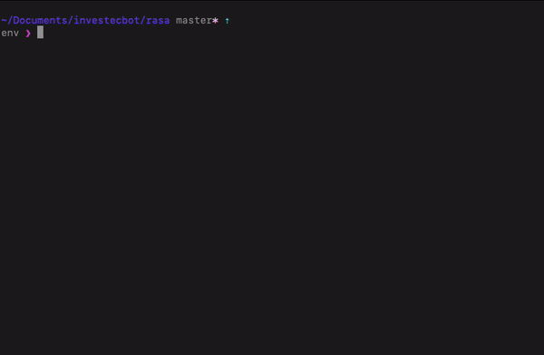

# Investec Bot 🦾

> A NLP service for interpreting transaction data from Investec Programmable Card API 🤖

### Example 👇



### Setup 👇

*Each step should be conducted in a separate terminal window.*

0. Navigate setup your environment and install dependencies.
* Setup Server
```
cd server/
python3.7 -m virtualenv env
source env/bin/activate
pip install flask
pip install flask_sqlalchemy
```

* Setup Rasa
```
cd rasa/
python3.7 -m virtualenv env
source env/bin/activate
pip install rasa
```


1. Init DB + Flask server - responsible for requests to DB.

  ```
  cd server/
  source env/bin/activate
  python run.py
  ```


2. Init Ngrok server - responsible for making Flask server + DB publicly accessible. Required for the rasa's action.py

  ```
  ./ngrok http 8080
  cd rasa/
  ```
  Edit `actions.py` and replace flaskServer variable with the ngrok server details.


3. Train Rasa Model

  ```
  cd rasa/
  source env/bin/activate
  rasa train
  ```


4. Init Rasa Action Server - responsible for parsing actions.

  ```
  cd rasa/
  source env/bin/activate
  rasa run actions
  ```


5. Init Rasa Duckling Server - responsible for interpreting dates/numbers.

  ```
  cd rasa/
  source env/bin/activate
  docker run -p 8000:8000 rasa/duckling
  ```


6. Init Rasa Shell - for interacting with Rasa.

  ```
  cd rasa/
  source env/bin/activate
  rasa shell
  ```


7. Enjoy 🌝


